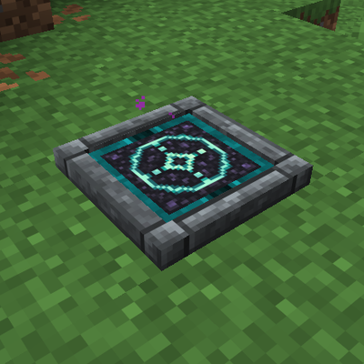
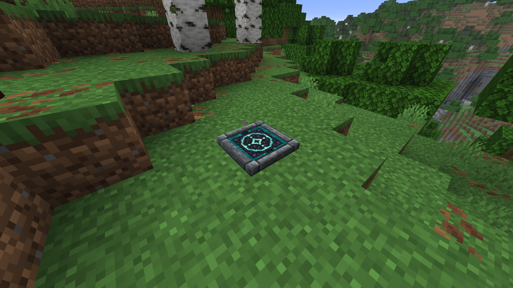
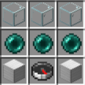

# Telepads — Unofficial Forge Port



Craft teleportation pads, name your destinations, and travel between bases,
mines, and dimensions. This is an independent adaptation of
[Telepad by Subaraki / AbsolemJackdaw](https://www.curseforge.com/minecraft/mc-mods/telepad)
for Minecraft Java 26.3. It is not an official release by the original author.

[Downloads](https://github.com/zeook1337/Minecraft-telepad-26.3/releases)
· [Source](https://github.com/zeook1337/Minecraft-telepad-26.3)
· [Report an issue](https://github.com/zeook1337/Minecraft-telepad-26.3/issues)

**Candidate version: `1.0.1` for Minecraft 26.3 — Alpha, stable acceptance pending.**
This candidate is not yet a published stable download. Legacy Telepads 1.19.2
worlds and data are not imported automatically. Back up existing worlds before
trying the candidate.

Candidate checks and the pending manual steps are recorded in
[acceptance](docs/acceptance.md) and the [release checklist](docs/release-checklist.md).

## Requirements

| Component | Supported / tested version |
| --- | --- |
| Minecraft | Java Edition 26.3 |
| Mod loader | Forge 66.0.9; build dependency `26.3-66.0.9` |
| Java | 25 |
| Installation | Client and dedicated server; matching mod versions |
| Other required mods | None |

The metadata accepts Forge `>=66.0.9, <67` and Minecraft `>=26.3, <26.4`.
Testing is limited to the exact versions above. Fabric, NeoForge, Bedrock,
older Minecraft releases, and migration from Telepads 1.19.2 are not supported.
Do not install this port alongside another mod with the `telepads` mod ID.

## Features

- Named destinations with a separate catalog and access permissions per player.
- A friends list and optional server-wide sharing when placing a pad.
- Cross-dimension travel with a Transmitter installed at the departure pad.
- Redstone control with a Toggler, plus dyeable frames and bases.
- Crafting-table dye mixing: a full eight-dye ring colors the frame and base rim together.
- Ender Beads for random destinations and a necklace for the nearest usable pad.
- Configurable waiting time, experience costs, and administrator destinations.
- Saved destinations for destroyed pads, with safe-arrival checks.
- Persistent world data and server-controlled travel permissions.

The port uses a low-profile platform with custom pixel textures: an Ender-style
turquoise teleport ring and rune, a stone-metal frame, and a dyeable base rim.
The frame and rim can be recolored while the rune retains its turquoise color.
The port also uses rewritten screens and does not reproduce the original animated
renderer. The new interface has English
translations; some legacy translations are retained, with English fallback.



## Installation

1. Install Minecraft Java 26.3 and Forge 66.0.9, running with Java 25.
2. Build candidate version 1.0.1 below. The
   [historical development release](https://github.com/zeook1337/Minecraft-telepad-26.3/releases/tag/v26.3-7.1.0-dev)
   is an older protocol-2 package, not this candidate.
3. Put `telepads-26.3-1.0.1.jar` in the instance's `mods/` directory.
4. For multiplayer, install the same JAR on the dedicated server and every client.
   This candidate requires network protocol 3. Protocol-1 and protocol-2 peers,
   including the historical published build and 1.0 Alpha, are incompatible.
5. Start the game and create a new world.

To upgrade a supported `26.3-7.1.0-dev` or `1.0` world, shut down and back up the
entire world, server configuration and original JAR. Update every client and
the server together. The network change preserves persistent codecs and earlier
private registrations; it does not publish previously private friend-shared pads.
Candidate world-upgrade acceptance is still pending. Roll back by restoring the
matching original JAR and untouched world backup, including `serverconfig`;
in-place downgrade of a candidate-saved world is not supported.

## Your first teleport

Craft two Telepads using this shaped recipe:



Place and name both pads. Stand on one for three seconds, then choose the other
from the destination list. The default experience cost is zero.

New pads are private. To register another player's private pad, visit it and
interact while sneaking with an empty main hand. Repeating the interaction removes
your registration. Press **`.`** to open the friends list; the key can be rebound
in Minecraft's controls. Up to nine friends can be added by their online name.
Confirm **Share with server** to make the pad public to every player, including
players who join later, without requiring friendship or individual registration.
This works in survival, even with an empty friends list; normal travel rules still
apply. The checkbox starts unchecked. Confirming without sharing or canceling
keeps the new pad private. Friend-list changes do not alter pad permissions.
Previously shared private pads keep their registrations and remain private;
existing public pads remain public. Install this updated build on both client
and server so the label matches its behavior.

Apply a **Transmitter** with right-click to enable travel to other dimensions
from that pad. Apply a **Toggler** to disable the pad while powered by redstone.
Creative/operator tools control public access and configured destinations.

To color a pad, use a crafting table with the layout `DDD / DTD / DDD`, where
`T` is the telepad and each `D` is any of the sixteen dyes. All eight dyes are
required. The preview blends one sample per dye slot with Minecraft's mixing
algorithm and applies it to both the frame and base rim; the turquoise motif
keeps its color. Taking the result consumes one pad and eight dyes and preserves
the pad's custom name and other components. Recrafting uses only the new dyes.

Direct-use dyes still override the frame first, then the rim. Washing returns
the latest eight crafting dyes once while either part retains the blend, plus
currently applied direct dyes. Fully overriding both parts discards the mixture
receipt. Washing preserves upgrades. Back up worlds before updating; a downgrade
after saving mixed palettes requires restoring the previous world backup.

See the [gameplay guide](docs/gameplay.md) for recipes, items, permissions,
colors, experience costs, and administrator tools.

## Configuration

Forge creates world-specific `serverconfig/telepads-server.toml` and client-side
`config/telepads-client.toml` during play.

| Server option | Default | Purpose |
| --- | --- | --- |
| `waitSeconds` | `3` | Activation delay |
| `xpLevels` | `0` | Experience levels charged after successful travel |
| `xpPoints` | `0` | Experience points; positive `xpLevels` takes priority |
| `blockEndWhileDragonAlive` | `true` | Block pad departures from the End while its dragon lives |
| `enableEnderBead` | `true` | Enable the random-destination item |
| `enableEnderBeadNecklace` | `true` | Enable the nearest-destination item |
| `enableAnvilConversion` | `true` | Convert Ender Pearls into Ender Beads |
| `destinations` | `[]` | Administrator destinations |

The client option `particles=true` controls teleport particles.
Configured destinations use `x/y/z/dimension/name` strings. Fixed destinations
need clear arrival space and support; the mod does not build a landing platform.
Failed or cancelled travel does not charge experience.

## Build from source

This directory is a standalone Gradle project. Its build does not require the
old Telepads project or a sibling tooling directory. Install a **JDK 25** and
select it through `JAVA_HOME` or your development environment. The first build
requires internet access to download Gradle and public dependencies.

Windows PowerShell, from the repository root:

```powershell
.\gradlew.bat --version
.\gradlew.bat clean build
```

Linux/macOS:

```sh
sh ./gradlew --version
sh ./gradlew clean build
```

Output: `build/libs/telepads-26.3-1.0.1.jar`.
The wrapper uses Gradle 9.7.1, with ForgeGradle 7.0.17, Foojay resolver 1.0.0,
and EventBus validator 7.0.6. `clean build` includes JUnit tests.

Optional in-game tests:

```powershell
.\gradlew.bat -PtelepadsGameTests runGameTestServer
```

**Build distribution JARs without `-PtelepadsGameTests` or other acceptance
properties.** These properties add test instrumentation. Run `clean build`
without them before packaging a release.

Historical server-sharing acceptance passed sixteen JUnit tests, nine GameTests, a real
client naming-form check, and two-client dedicated integration with restart.
Its historical clean JAR matched all 87 production runtime files of that package.
These results do not establish stable acceptance for candidate 1.0.1.

The archived `26.3-7.1.0-dev` acceptance recorded fourteen passing JUnit tests,
nine passing GameTests, actual crafting-menu checks, two-client color checks,
reconnection and server restart, and rejection of incompatible protocol-1 peers.
See [acceptance](docs/acceptance.md) and [development](docs/development.md).
Historical raw evidence is kept locally and excluded from Git.
The initial `7.0.0-dev` acceptance in that document is historical; its test counts
and artifact hash describe the earlier build.
Candidate acceptance helpers in `scripts/` take explicit local paths and bind
results to the frozen package; their commands and blocked real-client gate are
documented in [development](docs/development.md). Other scripts record historical
porting/acceptance workflows. They are not prerequisites for the standalone build.

## Reporting problems

Report the game, Forge, Java, and mod versions; steps to reproduce; expected
behavior; and other installed mods. Remove personal paths, server addresses,
player identifiers, and credentials before sharing logs or screenshots.
Third-party mod compatibility has not been comprehensively tested.
Use this port's [issue tracker](https://github.com/zeook1337/Minecraft-telepad-26.3/issues).

## License and credits

This adaptation is distributed under **GPL-3.0-only**; see [LICENSE.md](LICENSE.md).
The original mod is by **Subaraki / ArtixAllMighty / AbsolemJackdaw**, with preserved
credits to Commoble, StrickerRocker, and Darkhax.
See [NOTICE.md](NOTICE.md) for reused assets and changes, and
[FORGE-LICENSE.txt](FORGE-LICENSE.txt) for Forge MDK scaffolding notices.

- [Original project](https://www.curseforge.com/minecraft/mc-mods/telepad)
- [Original source](https://github.com/AbsolemJackdaw/Telepads2016)
- [Changes in this port](CHANGELOG.md)
- [GitHub and CurseForge publication guide](docs/PUBLISHING.md)

When distributing the compiled JAR, preserve these notices and provide access
to the complete corresponding source for that exact version under GPLv3.
The matching source for this development release is tagged
[`v26.3-7.1.0-dev`](https://github.com/zeook1337/Minecraft-telepad-26.3/tree/v26.3-7.1.0-dev)
and is also provided as a source ZIP with the release.
